# Raport: Objaśnialna Sztuczna Inteligencja (XAI) w Modelach Klasyfikacji

## Streszczenie (Abstract)
W niniejszym artykule przedstawiono próbę wyjaśnienia procesów decyzyjnych w wybranych modelach sztucznych sieci neuronowych, w tym wielowarstwowych perceptronach (MLP) oraz konwolucyjnych sieciach neuronowych (CNN), stworzonych z wykorzystaniem biblioteki PyTorch. Zastosowano bibliotekę Captum w celu zbadania zachowań modeli dla zbiorów danych różnego typu: tabelarycznych (Iris, Wine), oraz obrazowych (MNIST, Imagenette). Wykorzystano metody takie jak Feature Ablation, Saliency, LIME z segmentacją SLIC oraz analizę przykładów przeciwnych (Counterfactuals). Otrzymane wyniki wskazują, że metody XAI pozwalają zidentyfikować krytyczne atrybuty decyzyjne oraz ocenić wiarygodność działania skomplikowanych modeli typu "black box".

## 1. Wprowadzenie (Introduction)
Sztuczne sieci neuronowe wykazują wysoką skuteczność w wielu dziedzinach, lecz ich architektura sprawia, że działają one jako tzw. "czarne skrzynki" (ang. *black box*). Brak zrozumienia zasad podejmowania decyzji staje się problematyczny, zwłaszcza gdy modele te wpływają na decyzje krytyczne z punktu widzenia życia czy mienia człowieka.

Problem ten adresuje dziedzina objaśnialnej sztucznej inteligencji (ang. *Explainable Artificial Intelligence, XAI*). Celem objaśniania jest dostarczenie interpretacji, najczęściej dla pojedynczych predykcji (podejście lokalne) lub całego modelu (podejście globalne).

Problem formalnie definiujemy następująco: dla modelu $f: \mathbb{R}^n \rightarrow \mathbb{R}^k$ mapującego wektor cech wejściowych $x \in \mathbb{R}^n$ na wektor prawdopodobieństw klas $y \in \mathbb{R}^k$, poszukujemy funkcji atrybucji $A(x, f)$ bądź modyfikacji wejścia $\tilde{x}$ (przykładu przeciwnego), które pomogą zrozumieć, z czego wynika dana predykcja $f(x)$.

## 2. Powiązane prace (Related Works)
Objaśnialność modeli można podzielić na dwie główne kategorie:
- **Atrybucje:** Narzędzia takie jak LIME (Local Interpretable Model-agnostic Explanations) [1] czy Saliency Maps opierają się na analizie wrażliwości lokalnej. Saliency wykorzystuje gradienty modelu względem danych wejściowych [2].
- **Przykłady przeciwne (Counterfactuals):** Analiza modyfikacji sygnału wejściowego (np. perturbacje, zaszumianie, zasłanianie) w celu znalezienia jak najmniejszej zmiany powodującej zmianę decyzji modelu [3]. W bibliotece Captum możemy posiłkować się metodą ablacją cech (Feature Ablation), która zeruje lub podmienia cechy na wartości referencyjne (tzw. baseline).

## 3. Metody (Methods)
Eksperymenty przeprowadzono dla pięciu wariantów modeli:
1. **MLP Iris:** Sieć klasyfikująca kwiaty irysów. Badano wpływ poszczególnych zmiennych metodą *Feature Ablation*.
2. **MLP Wine:** Sieć rozróżniająca gatunki win (dane tabelaryczne, 13 cech). Zastosowano *Feature Ablation*.
3. **MLP MNIST (Zoning16):** Sieć klasyfikująca cyfry bazująca na ekstrahowanych 16 strefach z obrazu. Zastosowano *Feature Ablation*.
4. **CNN MNIST:** Konwolucyjna sieć neuronowa operująca na pikselach (28x28). Zbadano wpływ metodą *Saliency* oraz wykorzystano zasłanianie (perturbacje) do znalezienia kontrprzykładu.
5. **CNN Imagenette:** Skomplikowany model obrazowy. Zbadano metodą *LIME* w połączeniu z podziałem obrazu na komponenty (superpiksele) algorytmem *SLIC* (skikit-image).

**Wzór na ablację cech:** Dla zmiennej $x_i$, wyjście modelu jest badane przy zachowaniu $x_i$ kontra zastąpieniu $x_i$ wartością referencyjną $b_i$. Im większa różnica $\Delta y = f(x) - f(x|x_i \leftarrow b_i)$, tym istotniejsza cecha.

## 4. Wyniki (Results)

### A. Dane tabelaryczne (Iris i Wine)
Zastosowanie `Feature Ablation` wskazało, które cechy najsilniej decydują o przynależności do danych klas. W przypadku zbioru Iris wyraźnie widać różnice decyzyjne między klasami: dla klasy 0 kluczowe znaczenie miała długość kielicha (sepal length), a dla klas wyższych (np. klasy 2) decydująca była szerokość płatków (petal width). Poniższe grafiki oraz tabela prezentują ablację dla przedstawicieli klasy 0, 1 i 2 ze zbioru Iris.

| Cecha | Klasa 0 | Klasa 1 | Klasa 2 |
|---|---|---|---|
| sepal length (cm) | -3.8293 | 0.2412 | 2.8936 |
| sepal width (cm) | 2.9554 | -0.6618 | -0.5489 |
| petal length (cm) | -1.4697 | -1.1076 | 5.1655 |
| petal width (cm) | -0.2126 | -0.9452 | 3.9439 |

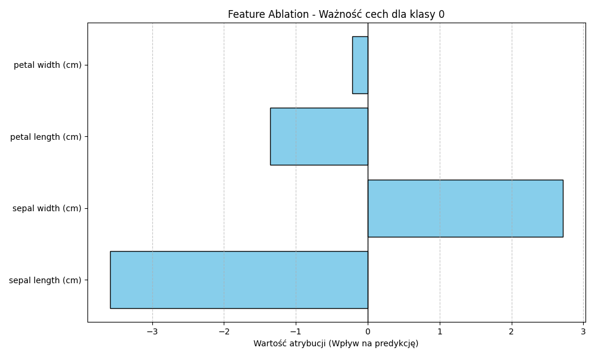
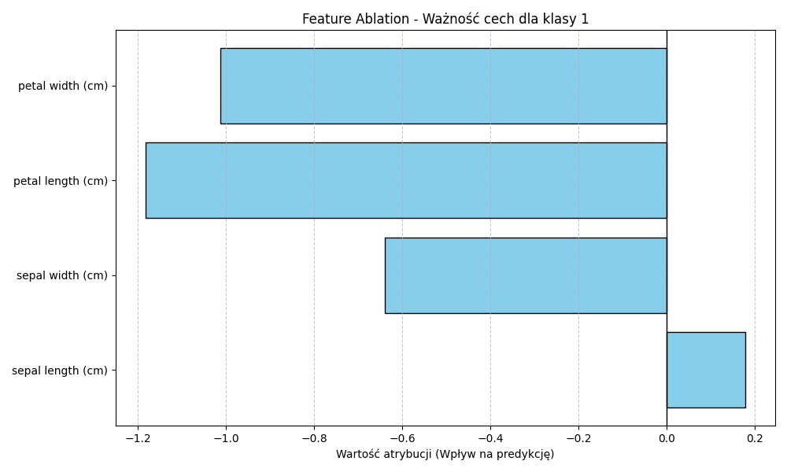
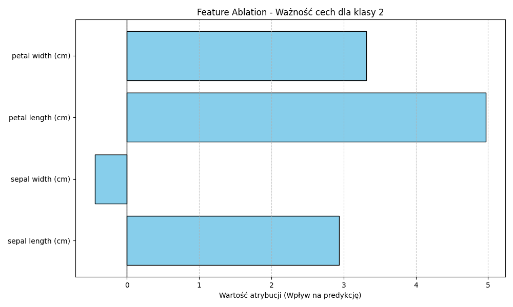

Podobne zjawisko zaobserwowano dla zbioru Wine. W zależności od docelowego wina (klasy 0, 1 i 2), atrybucja objaśnia odmienne kluczowe substancje (np. Prolina jest dominująca dla jednej klasy, podczas gdy dla innej znacznie większy wpływ ma kwasowość lub flawonoidy).

| Cecha | Klasa 0 | Klasa 1 | Klasa 2 |
|---|---|---|---|
| alcohol | 0.3522 | -1.2487 | 0.1129 |
| malic_acid | 0.0015 | -0.0869 | 0.1380 |
| ash | 0.0182 | -0.0536 | 0.0120 |
| alcalinity_of_ash | -1.5133 | -0.4452 | 2.2970 |
| magnesium | -12.6521 | 9.5168 | 7.4479 |
| total_phenols | 0.0287 | 0.2210 | 0.0464 |
| flavanoids | 0.2720 | -0.0226 | -0.0565 |
| nonflavanoid_phenols | -0.0304 | -0.0019 | 0.0588 |
| proanthocyanins | 0.1242 | 0.0259 | -0.0436 |
| color_intensity | -0.1438 | -0.4685 | 0.6217 |
| hue | 0.1292 | 0.0879 | -0.0398 |
| od280/od315_of_diluted_wines | 0.4713 | 0.1697 | -0.0141 |
| proline | 128.1493 | -2.8192 | -15.8466 |

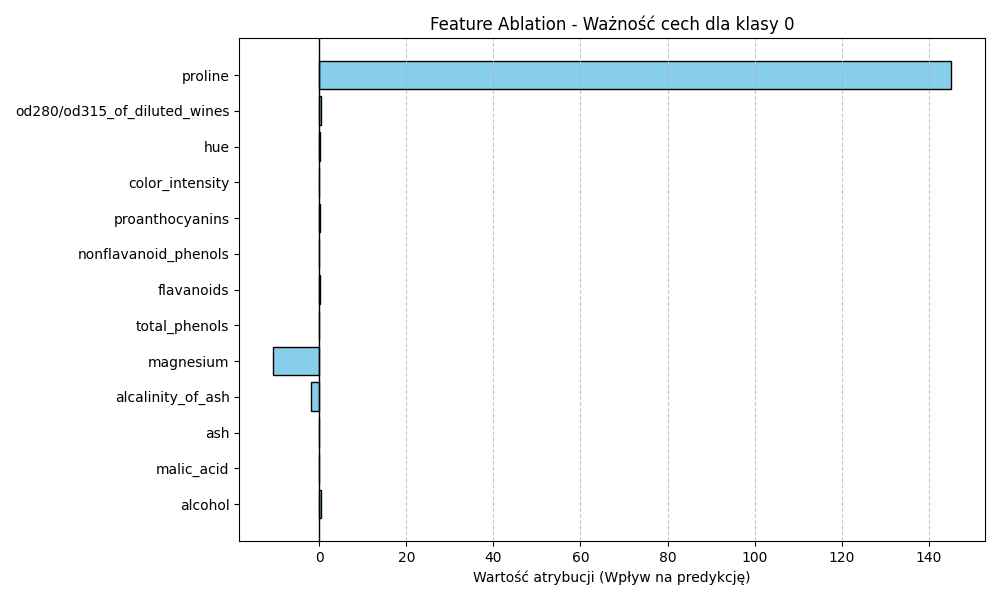
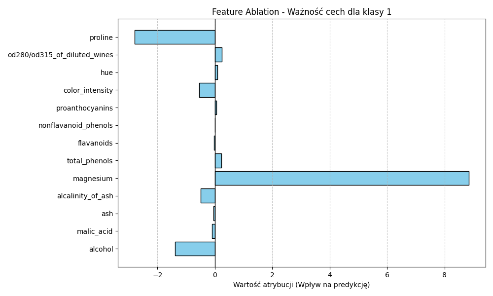
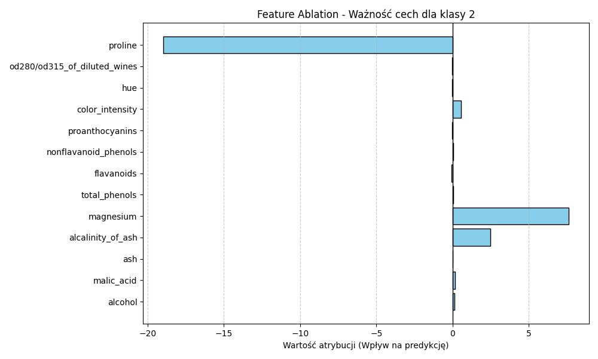

### B. Cyfry pisane odręcznie (MNIST)
Dla CNN MNIST użyto map atrybucji Saliency. Saliency map za każdym razem uodparnia model na czarne tło i zwraca precyzyjną wagę na ułożenie krzywizn. Poniżej zaprezentowano przykład dla cyfry 6.

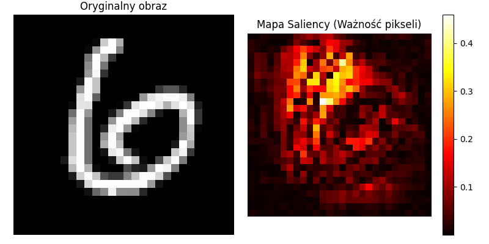

Przykład przeciwny (perturbacja przez zasłanianie od dołu) uwidocznił ciekawy moment deklasyfikacji: zakrycie dolnej podstawy dla cyfry "6" (co prowadzi do rozpoznania cyfry "4") oraz cyfry "5" (zmiana w kierunku "7") dezinformuje model i nakazuje w tych rzędach zmienić klasyfikację. Z kolei dla testowej "1" (gdzie krzywa jest niemal pionową osią) zasłanianie wierszy nigdy nie zmyliło predykcji modelu (aż do całkowitego zaciemnienia).
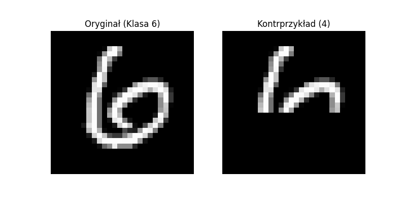
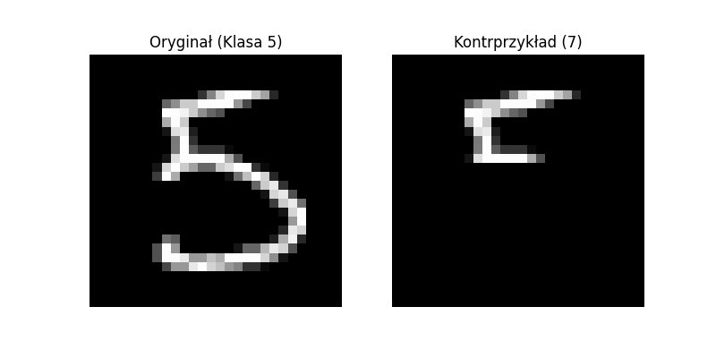

### C. Zbiór obrazowy (Imagenette)
Dla bardzo złożonych danych użyto metody LIME w połączeniu z segmentacją SLIC. Poniżej przedstawiono rezultaty poszukiwań komponentów dla różnych próbek, na których można zauważyć jak czerwone plamy (superpiksele podbijające wynik predykcji klasyfikacyjnej) koncentrują się na samych figurach głównych obiektów, a omijają nieistotne tło.
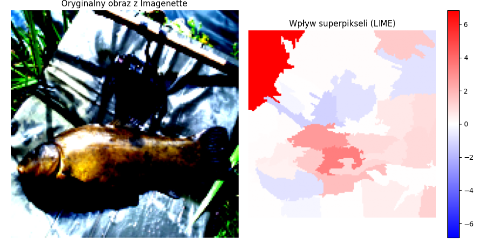
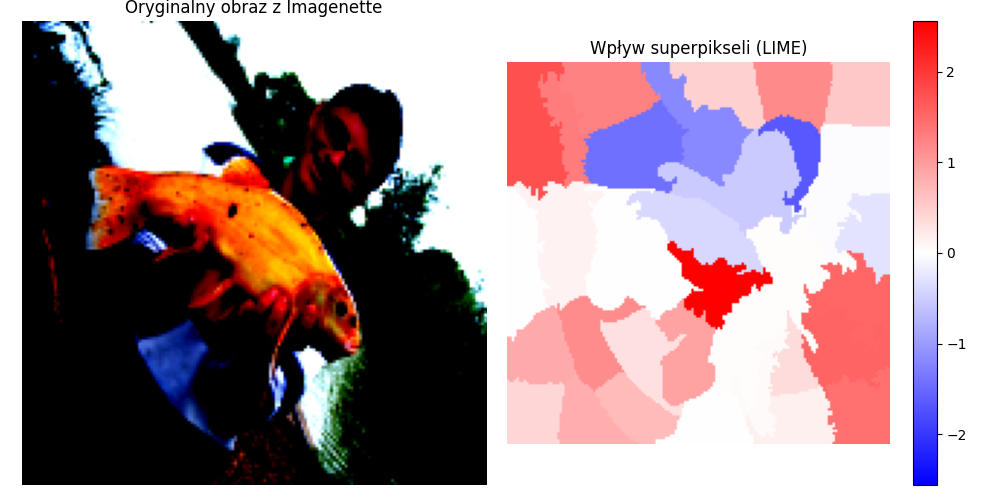
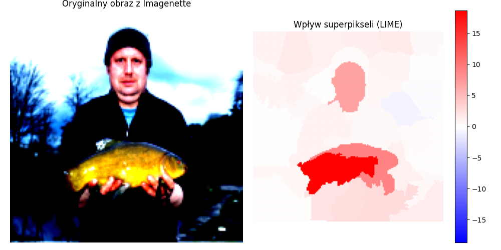

## 5. Podsumowanie (Summary)
Eksperymenty przeprowadzone na modelach neuronowych z użyciem biblioteki PyTorch oraz Captum ukazały, że "czarne skrzynki" nie muszą pozostawać całkowicie ukryte. Zastosowane metody lokalne na wielorakich wariantach próbek udowodniły, że modele te wykazują duży stopień rzetelności - atrybucje skupiają się zazwyczaj na głównym i merytorycznie sensownym motywie (np. kształt cyfry, odpowiedni obiekt na zdjęciu), co potwierdza ich sens naukowy. Rozszerzenie eksperymentu na wiele klas i wizualizacji wzmocniło argument globalny o stałym i uwarunkowanym merytorycznie (a nie losowo) sposobie działania sieci neuronowych.

## Spis literatury (References)
[1] Ribeiro, M. T., Singh, S., & Guestrin, C. (2016). "Why Should I Trust You?": Explaining the Predictions of Any Classifier. *Proceedings of the 22nd ACM SIGKDD*.
[2] Simonyan, K., Vedaldi, A., & Zisserman, A. (2013). Deep Inside Convolutional Networks: Visualising Image Classification Models and Saliency Maps. *arXiv preprint arXiv:1312.6034*.
[3] Wachter, S., Mittelstadt, B., & Russell, C. (2017). Counterfactual explanations without opening the black box: Automated decisions and the GDPR. *Harv. JL & Tech.*, 31, 841.
